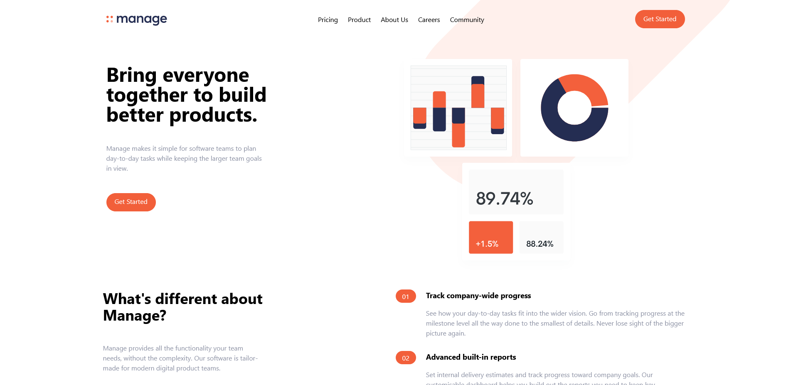
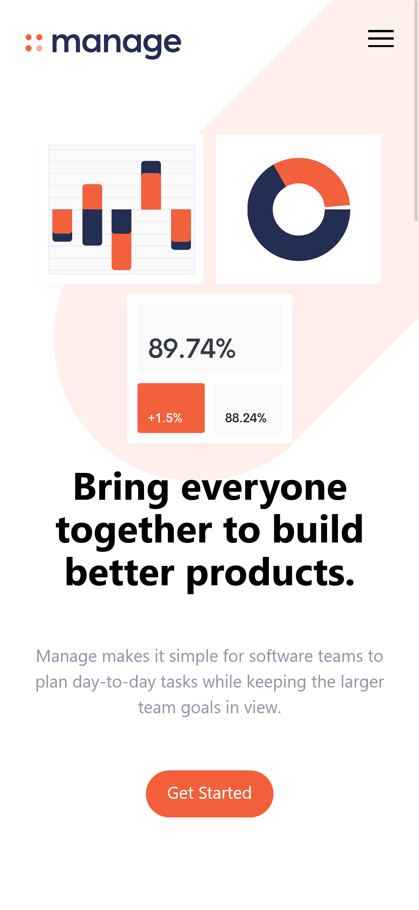

# Project Title

A simple Landing page for a company built using HTML and TailwindCSS. Based on a
Frontend Mentor Challenge.

## Usage/Examples

The purpose of this project was to recreate a HTML landing page from the designs
provided by
[Frontend Mentor](https://www.frontendmentor.io/challenges/manage-landing-page-SLXqC6P5)

## Tech Stack

**Client:** HTML, CSS, TailwindCSS

## Authors

- [@haylzrandom](https://www.github.com/haylzrandom)

## Screenshots
Desktop Landing Page

Mobile Landing Page

